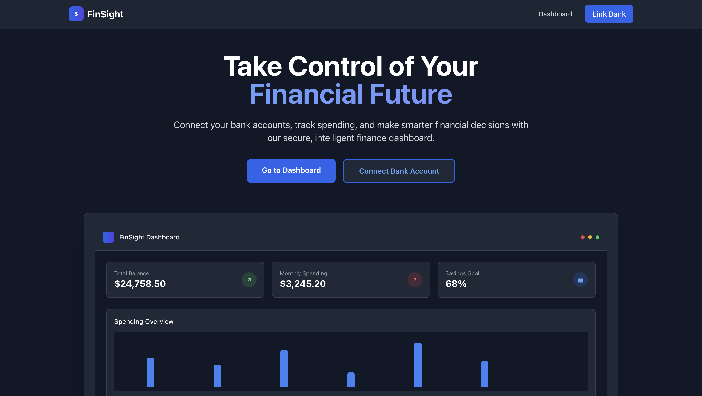
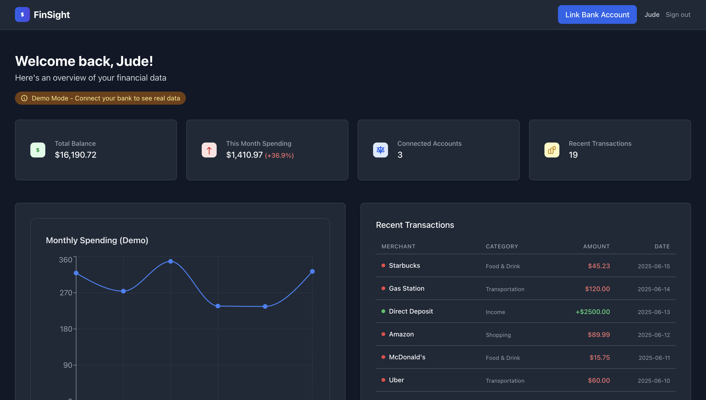

# FinSight

A modern personal finance dashboard application built with Next.js, NextAuth.js, and Plaid integration.

## 🚀 Check It Out

**[View Live Application](https://finsightapp.vercel.app)**

## Screenshots

### Homepage



### Dashboard



## Overview

Finance Dashboard helps users visualize their financial data through an elegant, intuitive interface. Connect your bank accounts via Plaid to automatically track spending, monitor balances, and gain insights into your financial health.

## Features

- 🔐 **Google Authentication**: Secure login with Google OAuth via NextAuth.js
- 🏦 **Bank Integration**: Connect securely to your financial institutions via Plaid
- 📊 **Dashboard View**: See your financial data at a glance with interactive charts
- 📱 **Responsive Design**: Works on desktop, tablet, and mobile devices
- 🔒 **Protected Routes**: Secure pages that require authentication
- 🎨 **Modern UI**: Clean design with Tailwind CSS

## Tech Stack

### Frontend

- **Next.js 15**: React framework with App Router
- **NextAuth.js**: Authentication library for Next.js
- **Tailwind CSS**: Utility-first CSS framework
- **React Hook Form**: Form validation
- **Recharts**: Data visualization charts
- **Plaid Link**: React component for bank connections

### Backend

- **Next.js API Routes**: Serverless API endpoints
- **Plaid API**: Bank account and transaction data
- **NextAuth.js**: Session management

## Pages Structure

- `/` - Landing page with features overview
- `/login` - Google Sign-In page
- `/dashboard` - Protected main dashboard (requires auth)
- `/link-bank` - Protected Plaid Link integration (requires auth)

## Project Structure

```
frontend/
├── pages/
│   ├── api/
│   │   ├── auth/
│   │   │   └── [...nextauth].js     # NextAuth configuration
│   │   └── banking/                 # Plaid API endpoints
│   ├── index.js                     # Landing page
│   ├── login.js                     # Login page
│   ├── dashboard.js                 # Main dashboard (protected)
│   └── link-bank.js                 # Bank linking (protected)
├── src/
│   ├── components/
│   │   ├── auth/
│   │   │   └── withAuth.jsx         # HOC for route protection
│   │   └── ui/                      # UI components
│   └── context/                     # React context providers
└── lib/
    └── plaid.js                     # Plaid client configuration
```

## Key Features Implementation

### Authentication Flow

1. User clicks "Sign in with Google" on login page
2. NextAuth.js handles OAuth flow with Google
3. User is redirected to dashboard upon successful auth
4. Protected routes use `withAuth` HOC to check authentication

### Plaid Integration

1. User navigates to `/link-bank` (protected route)
2. Frontend requests link token from API
3. Plaid Link component opens bank selection
4. User connects bank account
5. Public token is exchanged for access token
6. Account and transaction data is fetched and stored

### Route Protection

- `withAuth` HOC wraps protected components
- Checks session status and redirects to login if needed
- Shows loading spinner during authentication check

## Environment Variables

| Variable               | Description                                        | Required |
| ---------------------- | -------------------------------------------------- | -------- |
| `NEXTAUTH_URL`         | Application URL                                    | ✅       |
| `NEXTAUTH_SECRET`      | Secret for JWT signing                             | ✅       |
| `GOOGLE_CLIENT_ID`     | Google OAuth Client ID                             | ✅       |
| `GOOGLE_CLIENT_SECRET` | Google OAuth Secret                                | ✅       |
| `PLAID_CLIENT_ID`      | Plaid Client ID                                    | ✅       |
| `PLAID_SECRET`         | Plaid Secret Key                                   | ✅       |
| `PLAID_ENV`            | Plaid Environment (sandbox/development/production) | ✅       |

## Development Notes

- Uses Plaid sandbox environment for testing
- Bank data is temporarily stored in localStorage (for demo)
- In production, implement proper data persistence
- All sensitive operations happen server-side

## Next Steps for Production

1. **Database Integration**: Replace localStorage with proper database
2. **User Data Persistence**: Store user profiles and settings
3. **Enhanced Security**: Implement proper token storage and rotation
4. **Error Handling**: Add comprehensive error boundaries
5. **Testing**: Add unit and integration tests
6. **Monitoring**: Add logging and analytics

## License

This project is licensed under the MIT License - see the LICENSE file for details.

## Acknowledgments

- [Next.js](https://nextjs.org/)
- [Tailwind CSS](https://tailwindcss.com/)
- [React](https://reactjs.org/)
- [FastAPI](https://fastapi.tiangolo.com/)
- [Vercel](https://vercel.com/) for hosting
